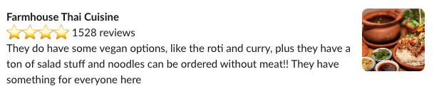
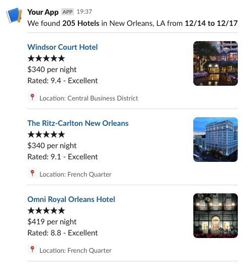
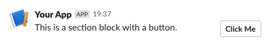
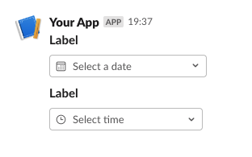

---

## Slack | Custom Blocks

Custom Blocks extend the Voiceflow step kit by allowing builders to create their own steps to use on the canvas.

These Custom Block templates use the [Slack Block Kit](https://app.slack.com/block-kit-builder) format.

### [section_image.json](section-image.json)

**User**: Slack user's id

**Channel**: Slack channel's id

**Text**: Text in markdown format

**URL**: Full URL of the image

**AltText**: Alternative text for the image

________
### [search_results.json](search-results.json)

**User**: Slack user's id

**Channel**: Slack channel's id

**Text**: Text in markdown format

**resultText1**: Text for result 1 in markdown format

**resultImgURL1**: Full URL of the image for result 1

**resultAltText1**: Alternative text for the image for result 1

**resultLocation1**: Location for result 1

**resultText2**: Text for result 2 in markdown format

**resultImgURL2**: Full URL of the image for result 2

**resultAltText2**: Alternative text for the image for result 2

**resultLocation2**: Location for result 2

**resultText3**: Text for result 3 in markdown format

**resultImgURL3**: Full URL of the image for result 3

**resultAltText3**: Alternative text for the image for result 3

**resultLocation3**: Location for result 3

________
### [link.json](link.json)

**User**: Slack user's id

**Channel**: Slack channel's id

**Text**: Text for the link

**ButtonLabel**: Label for the button

**URL**: Full URL of the link

________
### [date-time-picker.json](date-time-picker.json)

**User**: Slack user's id

**Channel**: Slack channel's id

**InitialDate**: Initial date for the date picker. *Format YYYY-MM-DD*

**DatePlaceholder**: Placeholder for the date picker. *Ex: Select a date*

**DateLabel**: Label for the date picker.

**InitialTime**: Initial time for the time picker. *Format HH:MM*

**TimePlaceholder**: Placeholder for the time picker. *Ex: Select time*

**TimeLabel**: Label for the date picker.

## Contributing to the community

We are very happy to receive and merge your contributions into this repository!

## Need help?

💻 Website: [https://voiceflow.com/](https://voiceflow.com/)

📄 Docs: [https://developer.voiceflow.com/docs](https://developer.voiceflow.com/docs)

🐦 Twitter: [https://twitter.com/VoiceflowHQ](https://twitter.com/VoiceflowHQ)
